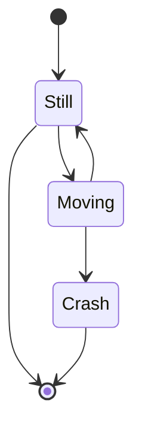
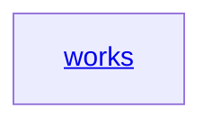

# A tétel címe

[előző](link) | [tételsor](0.%20Tételsor.md) | [következő](link)

## Előzetes információk

- [link ami a témához kapcsolódik és korábbi tanulmányok része](link)
- [másik link ami a témához kapcsolódik és korábbi tanulmányok része](link)

Kifejtés amit nem találtál meg leírva korábban

## Első témakör a tétel cím alapján

### Csop. 1

Ez | egy | egyszerű | táblázat
--- | --- | --- | ---
Csop. 1 teszt adat
Ez egy <br> sortörés | **félkövér** | _dőlt_

### Csop. 2

<table>
    <thead>
        <tr>
            <th>Ez</th>
            <th>egy</th>
            <th>bonyolúltabb</th>
            <th>táblázat</th>
        </tr>
    </thead>
    <tbody>
        <tr>
            <td>Csoport 2 teszt adat</td>
            <td rowspan=2>mindkettő adatra jellemző információ</td>
            <td>infó 1</td>
        </tr>
        <tr>
            <td>csoport 2 teszt adat 2</td>
            <td>infó 2</td>
        </tr>
    </tbody>
</table>

<!--
<table>
  <tr>
    <th>
  </tr>
  <tbody>
    <tr>
      <td>
    </tr>
  </tbody>
</table>
-->

[színes szöveg:](https://github.com/orgs/community/discussions/31570#:~:text=Author-,Find%20a%20way%20to%20colorfy%20text%20in%20Github%20in%20the%20best%20way%20now%20(Since%20May%202022)!,-If%20i%20use)

$${\color{red}piros}$$

### Ez egy gráf

[bővebben](https://docs.github.com/en/get-started/writing-on-github/working-with-advanced-formatting/creating-diagrams)

[még több grafikon](https://mermaid.js.org/syntax/stateDiagram.html)





<details>

<summary>Ez egy lenyitható fül</summary>

[bővebben](https://docs.github.com/en/get-started/writing-on-github/working-with-advanced-formatting/organizing-information-with-collapsed-sections)

### You can add a header

You can add text within a collapsed section.

You can add an image or a code block, too.

```ruby
   puts "Hello World"
```

</details>

### Ez egy matematikai képlet

[bővebben](https://docs.github.com/en/get-started/writing-on-github/working-with-advanced-formatting/writing-mathematical-expressions)

The Cauchy-Schwarz Inequality

```math
\left( \sum_{k=1}^n a_k b_k \right)^2 \leq \left( \sum_{k=1}^n a_k^2 \right) \left( \sum_{k=1}^n b_k^2 \right)
```

[előző](link) | [tételsor](0.%20Tételsor.md) | [következő](link)
